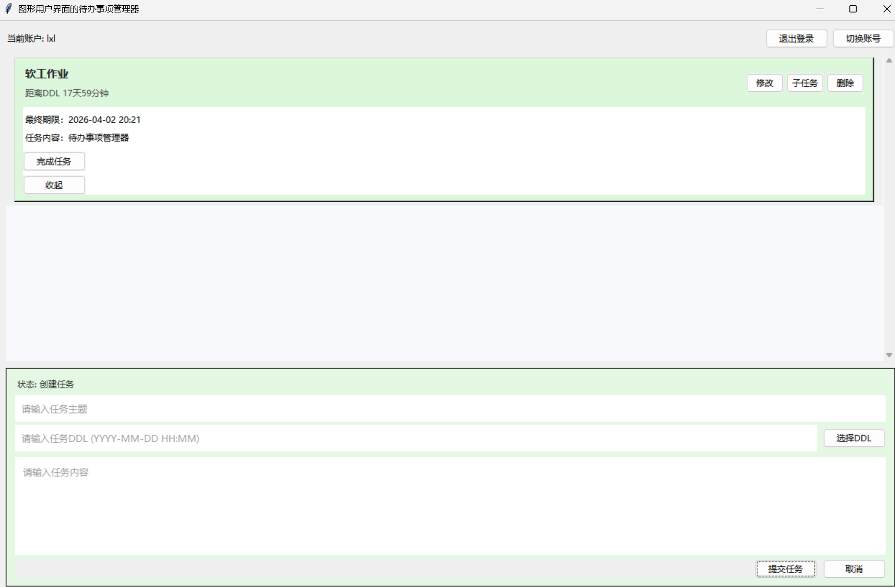

# Vibe Coding体验：AI使用报告
## 使用了什么AI工具？
GPT5.3-Codex（用于写代码） 、 GPT5.4（用于回答问题）
开发过程中使用**Cursor + Codex插件**
## 在哪些环节使用了AI？
### 制定需求环节
没有使用AI，完全按照我对该软件设计的构想进行描述，比如任务输入框是什么形式、任务列表怎么设计、父任务子任务如何协调等等。详细描述在**附录A：需求文档**中。
### 代码实现环节
Vibe-Coding！AI理解需求文档后，把功能实现得很好（我描述得比较清楚的那部分，没描述清楚的部分当然不能让人完全满意）。当然初次实现的UI不够美观，就像这样：

所以我让他转为写一个Web网页，只需一次提示词，就写得差不多了，而且美观度大大提高。
### 代码修改环节
我没有直接参与代码修改，而是简单使用软件后发现哪里不合我的心意，再告诉AI让他进行修改，比如排版细节、按键设置、功能补充、界面美化等等，基本都能很好得完成。
这里我秉持的观念是，一次只让他修改一个功能或细节，改完我测试一下，这样保证项目的稳定性。
### 撰写项目报告
由于我们对该项目代码情况的了解程度远不及AI，所以让AI第一次构建了项目之后就给出了项目报告，内容包括项目概览、功能说明、前端后端的技术架构、运行环境、使用流程等。并且每次进行代码修改后，AI都会帮我们修改项目报告。最后我让AI润色了一下项目报告，因为原本的报告略显混乱。另外我发现，“功能说明”这部分基本是按照我的需求文档撰写的。
### 代码测试环节
这里我使用了人工+AI结合的方式。我通过自己连续多天的使用来验证软件的基本功能，或者制造一些特殊样例来验证某些功能；另外我让AI想办法测试，我发现它主要是测试了**账户系统**的各种功能，比如：
- health 存活检查
- 注册、登录
- 任务保存与重新读取
- 重复注册报错
- 错误密码报错
- 非法 tasks 数据报错
- 不同账号数据隔离
- 缺少 username 的错误分支
AI自己也承认，目前还没有浏览器级 E2E 测试，所以像任务展开、DDL 弹窗、提醒弹窗、localStorage 恢复这类前端交互，还不能说“已经被自动化保证”
### AI使用报告
这当然是我自己写的。

## 对AI的评价
### 代码可用性：
从本项目来看，只要提示词说得相对清楚，它就能生成你期望的代码，大多数没有令你满意的部分都源于**模糊的提示词**或**忽略了某些细节的描述**。
### 优点：
1. 方便快捷。在vibe coding风靡之前，完成这样一个项目恐怕要三周，就算有了Ask版本得大模型，可能也要一周多。而有了vibe coding，我们可能一两天（如果极限一点，甚至一小时）就可以把它做得很完善。这是效率上的巨大提升。
1. 编译不出错。我记得去年vibe coding有时会出现编译不通过的情况，现在codex似乎加强了编译检查，所以几乎没有编译错误。
1. 基本功能准确无误。如果让我们自己写代码，可能一个功能就要写好久，还很可能出现一个又一个逻辑漏洞，但AI起码能保证基本功能的正确性（边界情况也许会出错？），不需要一次又一次运行、测试、修改了
1. 页面美观。似乎AI很会美化Web页面，包括各大公司放出的新模型demo里面，都能让AI写出很漂亮的UI，这比人来美化方便太多了。像我几乎没写过前端，如果自己写，又要学好久。
### 缺点：
1. 测试无法保证。回想我第一个提示词，它直接生成了一个能用的软件，这里面功能有很多，人很难完整测试，AI能完整地测试吗？目前来看似乎不太行，所以你用30分钟生成的软件，测试就成了一个艰巨的任务。
1. 人对代码掌控程度太低。AI一次给我们生成了上千行代码，我们是不可能去阅读的，这就导致了一个问题——我们不得不无条件相信AI，而放弃对代码的掌控。我们对项目的控制，似乎只剩下了自然语言，有些bug只能在出现后，再给AI描述一遍了。
1. 我们要向AI“妥协”。我们本次用AI直接写出了基本符合我们要求的软件，但仍不是完全符合我的设想，但也只能“差不多得了”“已经很好了”，似乎很难用语言描述达到我们脑海中设想的效果，而且项目框架已经确定，自己去改也非常不现实，因而只能妥协。

## 经验与困难
### 经验：
1. 提示词很重要。我们最好尽可能地详细描述需求，才能让AI的输出接近我们的设想
1. 修改代码时一步一步来。为了保证项目的可维护性，当我们发现问题是，最好是让AI改一个我们测试一个，防止有些修改的功能没有被测试，或者项目混乱。
1. 如果可以，尝试画一幅示意图给AI，效果也许会更好（当然我没有这个水平）。
### 困难：
最大的困难也许就是不同开发环境下的网络问题了，需要查很多帖子才能找到解决办法，顺利使用AI。

## 附录A：需求文档
```
项目名称：图形用户界面的待办事项管理器

软件功能：
1. 基础界面与操作：提供美观且易于使用的图形界面，界面应至少包含任务输入框、任务列表、新增按钮、删除按钮、完成按钮；
2. 数据持久化：管理器启动时需自动加载历史任务数据，并在任务更新时实时保存，确保关闭软件后数据不丢失；
3. 父任务与子任务：支持为一个父任务添加多个子任务，只有当所有子任务完成时，父任务自动被标记为完成；
4. 任务提醒：管理器应支持任务提醒功能。用户可以为任务设置时间，并在设定时间到达时以任意形式进行提醒。

基本样式：
横版，类似ChatGPT网页版，下面是任务输入框，上面是任务列表。但要注意，任务输入框是大框，就像是chatgpt的对话输入框，置于底部，任务输入框是用来输入任务内容的；在大框的上方，应有两行小框（细长横行那种），第一行是任务主题，第二行是任务DDL。每个框中都要有给用户的提示词，比如"请输入任务主题"。任务列表是展开式的，具体我会在后面详细介绍

任务输入框：
1. 任务输入框可以用不同颜色表示不同的输入状态，比如绿色表示创建新的父任务，我暂时能想到几种状态：创建任务、创建子任务、修改任务、修改子任务。当处于某种输入状态时，状态名称应显示在输入框旁边，并用对应的颜色标识。
2. 点击任务DDL输入位置时，可以弹出日历和计时器，比如左边日历、右边计时器+时区。

任务列表：
1. 这个部分是主体
2. 提交任务后，任务列表的任务排列顺序应按待办ddl从近到远的顺序从上到下进行排列
3. 在鼠标没有放到该任务上时，任务列表显示任务时应包含任务主题和距离DDL的时间。如果有子任务，任务主题后应该用与任务主题不同的字体（小于任务主题的字体大小）写"-包含x项子任务"。并且，在有子任务的情况下，距离DDL的时间变成距离最近子任务的DDL的时间
4. 当鼠标放到该任务上时，该条任务需要有特效（比如变大，具体我也说不清楚，你怎么美观怎么来），并且任务的最右侧显示三个图标，分别表示修改任务、添加子任务和删除任务（鼠标放在对应图标上时应该显示对应文字）。
5. 接下来我要重点说这三个按钮：如果点击"修改任务"，则任务输入框（任务主题、任务DDL、任务内容）填充上原本的内容，便于直接修改（修改父任务不需要管子任务，只填充父任务的信息；修改子任务只需要出现子任务的信息）
6. 当鼠标点击任务时，任务的详细信息会展开，注意不是新跳出一个框，而是直接在任务列表中展开，显示最终期限（日期+时间）、任务内容、子任务列表（如果没有子任务就不显示子任务列表）

关于子任务
1. 我们只支持一层子任务，也就是说任务要么是父任务，要么是子任务，不存在子任务的子任务
2. 在任务详细信息中，子任务列表（如果有）应该是默认收起的，并且标注“已完成n/m”，点击后才会展开，出现一条条子任务，依旧是显示任务主题和距离DDL的时间，排序标准同父任务。当鼠标放上去的时候，该条子任务最右侧显示两个图标，分别表示修改子任务和删除子任务。
3. 点击某条子任务后，依旧显示详细信息（主题、最终期限、内容）
由于我们的任务列表和子任务列表都是展开式的，而不弹出新的显示框，所以展开后应有“收起按钮”
4. 子任务DDL影响父任务，一旦父任务有了子任务，那么除了父任务的详细信息中的最终期限、修改父任务时的DDL输入框填充是原本设定的DDL，其余的显示（主要指任务列表显示的距离DDL的时间）均以最近未完成的子任务DDL为准

关于DDL：
父任务的DDL应始终大于子任务，DDL设置应始终大于系统时间，这是校验DDL合法性的标准。

账户系统：
我们应构建简易的账户系统，包含创建账户和登录，每个账户保存自己的数据，也就是数据持久化，当重新登上自己的账户时，之前创建的任务应该都显示出来。主界面应该也显示账户信息，并且提供退出登录、切换账号的选项

任务紧急程度：
我们把任务分为红、黄、绿三种紧急程度，肯定是根据DDL的远近划分，划分标准你来定。父任务列表和子任务列表都是如此

超出期限怎么办？
任务被标注成蓝色，置于任务列表的最上方，显示任务主题和超出DDL的时间。把鼠标放上去，最右侧只剩下删除任务的图标

已完成怎么办？
完成的按键放在任务的详细信息中，如果父任务有子任务，那父任务的详细信息中没有完成任务的按键，只有子任务的详细信息中可以点击完成任务，子任务全部完成则父任务自动完成。已经完成的任务放到任务列表的最末端，标注成灰色，在任务列表中显示任务主题和“于xxxx完成”。同样鼠标放在上面时最右侧只剩下删除任务图标。

提醒功能：
如果该账户处于登录状态，若任务尚未完成，在距离DDL5分钟时弹窗提醒即将到时间，在DDL到来时再次弹窗提醒一次

在完成任务后，还应给出：
1. 项目说明文档：包含项目介绍、功能说明、运行环境、运行方式；
2. 依赖文档：需记录项目所需的依赖库或运行环境配置；
```

## 附录B：提示词记录
- Q1：根据我写的需求文档，实现这个软件。
效果：用Python标准库实现了桌面版软件，但我认为UI太呆板了。基本功能实现的不错。
- Q2：大哥，功能确实基本都实现了，但你写这个UI太难看了，是不是用纯Python写程序限制你的发挥了。要不你把这个项目写成Web网页，是不是更有利于你发挥？界面写得漂亮、炫酷一点，并按照需求文档的要求（功能性你完成的不错），展现你作为世界最强AI之一的实力，你看人家Gemini放出的demo写的多漂亮，你就甘居人后吗！
效果：基本上符合我的要求，但“收起”按钮的放置位置很不方便，并且展开任务“详细内容”后，内容没有平铺而是“挤在一块”，有点混乱，我想让视觉效果更清晰、大气一点。
- Q3：明显好看多了，但是任务列表还是有点乱，我希望点开详细内容之后，详细内容仍然从左到右占据块，而不是聚集在右侧或者根据实际内容长度调整大小，子任务列表也同理，从左到右占据块就行了，要不太乱；另一点是点开某个任务后，最好“收起”按钮就是一个小箭头，在原任务行的左右侧，这样用起来方便。
效果：我的要求都进行了改动，并提出优化“收起”按键的视觉效果。
- Q4：行，就按你说的，把小箭头做成“悬浮更轻 + hover 发光”的版本，进一步提升质感，不过小箭头保留左侧就行了。
效果：案件更有质感，但使用过程中发现“过期任务”没有“完成“按键，这似乎不太合理。
- Q5：有一个逻辑我没有说清楚，就是如果任务超时，完成任务的按钮仍然保留，毕竟你要给人改过自新的机会嘛。
效果：为“过期任务”增加了“完成”按键。
- Q6：还能不能让网页更有质感一些了？
效果：网页增加了一些渐变效果等。
- Q7：数据持久化是怎么做到的，能保存多久，靠谱吗？
效果：AI告诉我他把数据存在浏览器中，我觉得这种方法很不稳定，我认为存在本地服务器会好一点。
- Q8：能不能更可靠一点，就存在我本地，而不是依赖一个浏览器。
效果：创建了data\web_store文件夹，账户信息存在`accounts.json`中，任务存在`task.json`中。
- Q9：你能不能对我这个项目进行测试，保证功能的可靠性。
效果：写了一些代码对账户系统进行了测试，但没有对其他功能测试。
- Q10：我把代码文件放在src文件夹里了，不想再当前文件夹（src）里保存data，而是在外面那一层的data问价夹里保存、读取data，你改一下。
效果：我原本创建src代码之后，在src中的data文件夹保存了数据，导致我再次打开软件时，数据没有了（原数据保存在外层）。修复后又可以连到原本的data了。

（......发现bug还要继续......）